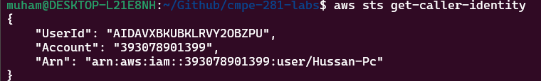

# Contents
- [AWS / AWS Command Line Interface (CLI)](#aws--aws-command-line-interface-cli)
  - [Step 1: Install awscli tool](#step-1-install-awscli-tool)
  - [Step 2: Setup IAM Credentials](#step-2-setup-iam-credentials)
  - [Step 3: Install aws-nuke](#step-3-install-aws-nuke)
- [Terraform](#terraform)
  - [Install tfenv](#install-tfenv)
  - [Install stable Terraform](#install-stable-terraform)
  - [Create using Terraform](#create-using-terraform)
  - [Verify your deployment succeeded](#verify-your-deployment-succeeded)
  - [Destroy using Terraform](#destroy-using-terraform)
- [Lab deliverables](#lab-deliverables)
  - [Files](#files)
  - [Knowledge check](#knowledge-check)
- [Reference docs](#reference-docs)

In today's lab, we are going to setup our AWS account, SSO auth, Docker, and Terraform.

# AWS / AWS Command Line Interface (CLI)

Create an AWS account before doing the following steps.

## Step 1: Install awscli tool

If you are on windows, you'll have a hard time using powershell/command prompt. I highly recommend you setup Windows Subsystem Linux for this course or a virtual machine.

[WSL Installation Guide](https://learn.microsoft.com/en-us/windows/wsl/install)

[Ubuntu VM with VirtualBox](https://ubuntu.com/tutorials/how-to-run-ubuntu-desktop-on-a-virtual-machine-using-virtualbox#1-overview)

1) Prep (update packages)
```
sudo apt update
sudo apt install -y curl unzip
```
2) Download and install awscli
```
curl "https://awscli.amazonaws.com/awscli-exe-linux-x86_64.zip" -o "awscliv2.zip"
unzip awscliv2.zip
sudo ./aws/install
```

## Step 2: Setup IAM Credentials

Create a user in IAM for your local machine and attach the PowerUser Policy.

Create an Access Key/Secret Key pair for that user. Download the .csv file with keys for later use.

It's good practice not to create key pairs for our root user. We want to use our laptops for development, not managing our accounts, which the root user can do.

Configure aws locally.

```
aws configure
```

Take a screenshot of this command successfully returning your created role. It should resemble the screenshot below.

```
aws sts get-caller-identity
```


## Step 3: Install aws-nuke

aws-nuke is a powerful tool which can help ensure that you have left no dangling resources when you are done working on your lab.

It is also a dangerous tool which can indiscriminately destroy every resource in your account, even the ones that come with it for free. e.g. default vpcs.

download and install the latest release from [ekristen/aws-nuke]https://github.com/ekristen/aws-nuke

# Terraform

For our labs, we will use Terraform to manage our deployed AWS resources. Read more about [Terraform Basics](https://developer.hashicorp.com/terraform/tutorials/aws-get-started/infrastructure-as-code) here.

## Install tfenv
Tfenv is a version manager for Terraform. Since terraform versions are not always backwards compatible, this is a helpful tool for managing multiple Terraform projects with different terraform versions. It is considered industry standard to use tfenv to handle terraform installation.   

**macOS**

```
brew install tfenv
```

**Linux/wsl2**

[tfenv Ubuntu installation guide ](https://maxat-akbanov.com/how-to-install-tfenv-terraform-version-manager-on-ubuntu-os)

## Install stable Terraform 

```
tfenv install 1.12.2 && tfenv use 1.12.2
```  

You should now be able to run Terraform. See help for list of commands.  

```
terraform -help
```

## Config in Terraform


Terraform is a cloud agnostic Infrastructure as Code tool, which means that we can use terraform to create resources in most third party clouds such as: AWS, GCP, Azure, Oracle Cloud, etc, by defining blocks of configuration. These blocks tell terraform where and what to create. 

In the provided main.tf file, we see this block of config:

```
provider "aws" {
  region = "us-west-2"
}
```
This block tells terraform that for this specific invocation, we want to create the resources in AWS and in the datacenter, us-west-2 (Oregon)

Next, we see a resource block:

```
resource "aws_instance" "app_server" {
  ami           = data.aws_ami.ubuntu.id
  instance_type = "t2.micro"
}
```
Here, we define a virtual server and pass two arguments. 
1. an AMI
2. an instance type

AMIs are like blueprints which are used to create a server. It tells AWS which operating system to use and what the starting state of the server will be. What is `data.aws_ami.ubuntu.id`? Let's break it down.

Terraform can reference attributes defined by other config blocks through a heirarchy of references. Let's look at the final block of config in the main.tf file.

```
data "aws_ami" "ubuntu" {
  most_recent = true

  filter {
    name = "name"
    values = ["ubuntu/images/hvm-ssd-gp3/ubuntu-noble-24.04-amd64-server-*"]
  }

  owners = ["099720109477"] # Canonical
}
```
Data blocks are a special type of block that tells terraform we want to access a resource in config that was defined outside of terraform.

Data blocks have their own types as well with predefined inputs which tell terraform how to look them up. In this block, we want to retrieve the latest ami of ubuntu noble 24.04 which runs on an amd64 architecture. So, we set the value `most_recent` to true to get the latest image. We filter from all the available images with the prefix of our desired ubuntu version with the filter block. And finally, we specify the owner of the AMI to ensure that we are getting the latest AMI which matches the filter from our trusted source. In this case, that's the account `"099720109477"`. This will find the resource stored in the cloud and bring its outputs into our state. We can now reference it using the notation above, `data.aws_ami.ubuntu.id` which tells terraform we want the item, from the data blocks, from the resource type aws_ami, from the specific resource ubuntu, from the output labeled id. There are many attributes of aws_ami we can reference at this point. Read more here.   

[Link to aws_ami attributes](https://registry.terraform.io/providers/hashicorp/aws/latest/docs/data-sources/ami#:~:text=the%20arguments%20above%3A-,id%20%2D%20ID%20of%20the%20AMI.,-arn%20%2D%20ARN%20of)

Let's talk about the instance type we're passing. `t2.micro`. Instance types defines how many virtual cores, memory, storage type, plus other things we want our instance to have.

In the definition, first we have the instance family, in this case `t2`, which stands for burstable performance instances, designed for general usage but also capable of handling "bursts" of increased load. Second we have `micro`, which tells us the size of the instance relating to the vCPU, memory, storage, and network performance. There are many different instance families, too many to reasonably remember, but it's important when you make a selection to know what you're optimizing for. We will discuss this more later in class, and you can learn more from AWS's page on instance types
[Link to AWS Doc on instance types](https://aws.amazon.com/ec2/instance-types/)


## Creating with Terraform

For terraform to communicate to AWS, it needs to speak AWS's language. To do that, we need to run 

```
terraform init 
```
This command will do a handful of things. It is important that you understand what every command you run does before you execute it.

1. Provider Installation: Downloads and installs the provider plugins, or as I explained above, the language to communicate to the provider in. 
2. Initialize Backend: Backend refers to a state file which terraform uses to keep track of the resources you've told it to manage, it can be local or stored remotely.
3. Installs Modules: Downloads referenced modules in your configuration. Modules are reusable libraries of terraform configuration. We will discuss this more later.
4. Prepare Working Directory:
  1. Creates lock file. The lock file exists to ensure that terraform does not try running two operations on one resource at the same time and to peg the state to a specific provider version. In terms of our analogy, this is terraform forcing itself to speak to the Cloud Provider using the same language it started with for this project.
  2. Create .terraform directory in your project. This is where downloaded modules and providers are stored.

Next, we will run a plan. This tells us what terraform will do if we try to deploy the current state of the directory. Note that a plan is dependent on the state of a directory. We can run a plan, change a file, and this can alter the output of the plan. To prevent missteps from occurring, plans can be outputted to a file.

```
terraform plan -out main.tfplan
```

Once we are happy with the output of the plan, we can execute it using. Note that passing in a plan is not necessary, if we don't pass in a plan, apply will simply create whatever is in the current state of the directory.

```
terraform apply main.tfplan
```


## Verify your deployment succeeded

Go to the AWS console and find the server we deployed in EC2 > instances.

Take a screenshot and save it in your repository.

## Destroy using Terraform

Once you have taken a screenshot of your running instance in AWS, it's time to destroy it using,

```
terraform destroy
```

Take a screenshot of the resources being destroyed.

# Practice aws-nuke

Recreate the instance and use aws-nuke to destroy it. Take a screenshot of aws-nuke finishing and destroying only your instance but leaving your IAM credentials in tact by passing in the predefined nuke-config.yml.

# Lab deliverables

Push the following files to your github repository.

## Files

- `main.tf`
- screenshot of `aws sts get-caller-identity` output
- screenshot of running AWS instance
- screenshot of `terraform destroy`
- screenshot of aws-nuke 

## Knowledge check

Additionally, research and answer the following questions in a text file named `lab1.txt`.

DO NOT USE AI. USAGE OF AI WILL RESULT IN A 0 FOR YOUR LAB AND A STEP TOWARDS DISCIPLINARY ACTION.

1. What are the advantages of cloud computing to hosting your own data centers?
2. What's the best practice for handling access to cloud environments?
3. What is IaC?
4. Name one advantage of IaC.
5. Briefly describe the purposes of the following "blocks" in terraform language: 
  - Terraform blocks
  - provider blocks
  - backend blocks
  - resource blocks
  - data blocks
  - output blocks
  - variable blocks
6. How will you ensure that you do not incur unintentional expenses? What will you do if you accidentally find yourself charged for cloud resources?

# Reference docs

- [Advantages of Cloud Computing](https://cloud.google.com/learn/advantages-of-cloud-computing)
- [Security Best Practices in IAM](https://docs.aws.amazon.com/IAM/latest/UserGuide/best-practices.html)
- [Terraform Basics](https://developer.hashicorp.com/terraform/tutorials/aws-get-started/infrastructure-as-code)
- [Tfenv Ubuntu installation guide ](https://maxat-akbanov.com/how-to-install-tfenv-terraform-version-manager-on-ubuntu-os)
- [Terraform tutorial](https://developer.hashicorp.com/terraform/tutorials/aws-get-started/aws-build)
- [aws-nuke](https://github.com/rebuy-de/aws-nuke)
- [Understanding unexpected charges](https://docs.aws.amazon.com/awsaccountbilling/latest/aboutv2/checklistforunwantedcharges.html)
