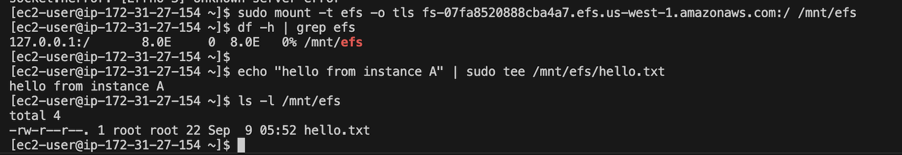
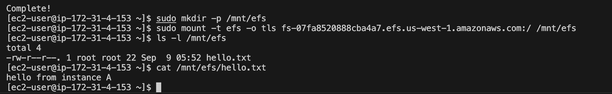

# CMPE281 Lab: Storage

In today's lab, we will explore the different storage classes available by AWS. We will start with creating an S3 bucket, and enabling versioning, encryption, and deletion protection. We will host a static site on S3, and we will discuss EFS and FSx Luster. To make this lab challenging, we will start to make the instructions more vague, requiring you to read more docs and get comfortable learning how things work on your own.

## Task 1: Create a New S3 Bucket and Upload a Folder (1 pt)

For this task, you need to uncomment the `aws_s3_bucket` and `aws_s3_object` in the `s3.tf` file and add the correct values. Use the documents below for reference. 

- [Terraform s3_bucket doc](https://registry.terraform.io/providers/hashicorp/aws/latest/docs/resources/s3_bucket)
- [Terraform s3_object doc](https://registry.terraform.io/providers/hashicorp/aws/latest/docs/resources/s3_object)
- [Uploading multiple files guide](https://stackoverflow.com/questions/57456167/uploading-multiple-files-in-aws-s3-from-terraform)

Take a screenshot of your s3 bucket in the aws console with the uploaded files.


## Task 2: Generate and Use a Presigned URL (1 pt)

1. Use the complete URL of a private object in an S3 bucket belonging to you to generate a presigned URL using a variation of this command:
   ```
   aws s3 presign s3://<bucket-name>/index.html --expires-in 600
   ```

2. Copy the full URL from the command output and open it from a browser.
3. If the content type is not set to the correct file type for each file, your browser can interpret the `index.html` as an executible and try to download it instead of displaying it as a webpage. See [how to add content types per file in Terraform](https://stackoverflow.com/questions/76170291/how-do-i-specify-multiple-content-types-to-my-s3-object-using-terraform).
4. If your page now loads a plain html doc, you are on the right path. Question: Why doesn't the page load properly? 
5. Uncomment the `s3-bucketpolicy.tf` file and look up the docs in Terraform for each resource to find the correct values.
6. This time, the page should load like it does locally. Take a screen shot with the loaded website and the presigned URL in the browser to show you've completed this task.
7. Wait for the URL to expire and try accessing it again. This time, you should get an AccessDenied error.


## Task 3: Enable Static Website Hosting for an S3 Bucket (1 pt)

This is a good opportunity to present yourself to the world by creating a portfolio website. 

Reference: [S3 bucket website configuration](https://registry.terraform.io/providers/hashicorp/aws/latest/docs/resources/s3_bucket_website_configuration)

Make sure your static website is publicly accessible.

Take a screenshot of your URL and webpage.

## Task 4: Enable Versioning, Object Lock, and Lifecycle Management for your S3 Bucket (2 pts)

Create a new file named `task-4.tf`.

In this file, include the Terraform code for enabling versioning and object-lock.

Use the references:
- [S3 bucket versioning](https://registry.terraform.io/providers/hashicorp/aws/latest/docs/resources/s3_bucket_versioning)
- [S3 bucket object lock config](https://registry.terraform.io/providers/hashicorp/aws/latest/docs/resources/s3_bucket_object_lock_configuration)

Take two screenshots in the AWS console of versioning and object lock enabled.

## Task 5: Provision EFS and Mount from Two EC2 Instances (3 pts)

For this task, create an Amazon EFS file system and mount it on two EC2 instances to demonstrate shared POSIX storage.

Create a new file named `efs.tf`. In this file, add the Terraform resources to:

 - Create an EFS file system (enable encryption).
 - Create mount targets for each subnet/AZ your instances will use.
 - Create security groups so that the EFS mount targets allow inbound TCP 2049 from your EC2 instances’ security group.

Launch two EC2 instances in the same VPC and in subnets that have a corresponding EFS mount target.

From Instance 1, install the EFS mount helper and mount the file system:

```
sudo yum -y install amazon-efs-utils || sudo dnf -y install amazon-efs-utils
sudo mkdir -p /mnt/efs
# Replace fs-XXXX with your EFS ID (DNS form: fs-XXXX.efs.<region>.amazonaws.com)
sudo mount -t efs -o tls fs-XXXX:/ /mnt/efs
df -h | grep efs
echo "hello-efs" | sudo tee /mnt/efs/hello.txt
ls -l /mnt/efs
```

From Instance 2, repeat the mount steps and verify shared access:

```
sudo yum -y install amazon-efs-utils || sudo dnf -y install amazon-efs-utils
sudo mkdir -p /mnt/efs
sudo mount -t efs -o tls fs-XXXX:/ /mnt/efs
ls -l /mnt/efs
cat /mnt/efs/hello.txt
```

Screenshots to include - 

1. EFS console showing the File system and Mount targets.
2. Terminal from Instance 1: df -h with EFS mounted and ls -l /mnt/efs showing hello.txt.


3. Terminal from Instance 2: ls -l /mnt/efs and cat /mnt/efs/hello.txt confirming the same file output (proves sharing).


# Deliverables

All screenshots and knowledge check answers must be put in a PDF file. 

## Knowledge Check (2 pts)

1. Explain how we use a single resource definition in task 1 to upload multiple files.
2. Explain why the bucket policy is required in task 2 to display the web-page properly.
3. What are the pros and cons of the resources you used in task 4?
4. Imagine you are managing an S3 bucket for a company that stores log files generated by their web applications. These log files are frequently accessed during the first 30 days after creation for analysis but are rarely accessed after that period. After 1 year, the logs don't need to be accessible immediately, but should be held for 5 years. Describe how you could use Amazon S3 Lifecycle Management to optimize storage costs for these log files. Include details on the lifecycle rules you would configure and how they would help reduce expenses.

## Lab Files

- `s3.tf`
- `s3-bucketpolicy.tf`
- `s3-staticwebsite.tf`
- `task-4.tf`
- `efs.tf`
- `lab-storage.pdf` (contains)
  - Screenshot of S3 bucket and files in AWS Console (Task 1)
  - Screenshot of presigned URL and displayable page (Task 2)
  - Link to Static URL and displayable page (Task 3)
  - Screenshots of lifecycle management rules, object lock and versioning enabled (Task 4)
  - Screenshots of EFS console, Terminals from Instance 1 and Instance 2 (Task 5)
  - Knowledge check
    - Answer to question 1
    - Answer to question 2
    - Answer to question 3
    - Answer to question 4
